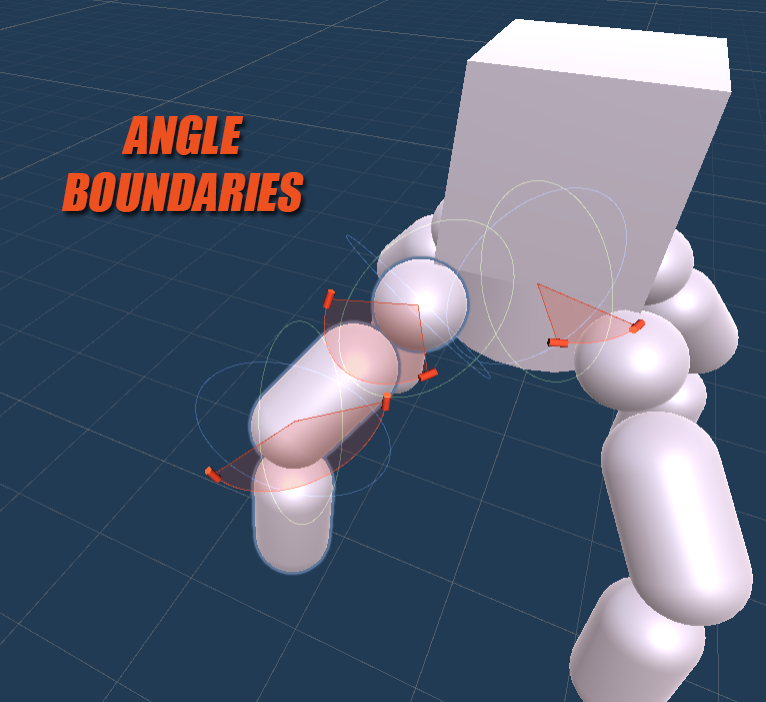
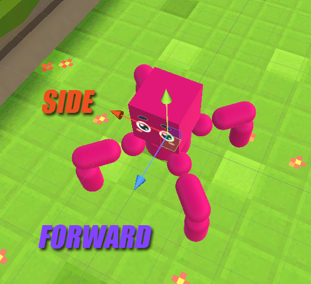
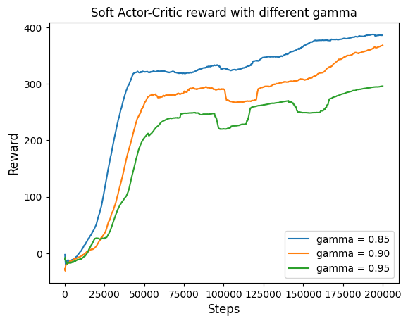

## Create and train custom locomotion robot with ML Agents and Gym

This spider was created in Unity using [ArticulationBody](https://docs.unity3d.com/Manual/class-ArticulationBody.html) physics, which creates realistic interactions. 
Despite its cartoonish appearance, the spider's gait is not controlled by animation or pre-written code, but by a neural network that was trained with [Gym](https://gymnasium.farama.org/index.html) using reinforcement learning algorithms.

## Enviroment

The environment is a spider robot with four legs - three motors (rotating joint) on each. In this configuration, the middle joint of each leg is fictitious (the rotation limit is set to 0 degrees) for visual demonstration and faster training. But it is possible to change the restrictions for all joints.

The spider's goal is to move forward as quickly as possible.

### Observation space:

36 values - angle velocity and position for each 12 joints as well as 6 coordinates and 6 velocities (position and Euler angle) for robot head.

### Action space:

12 values - discrete direction of movement for each rotating joint: -1 for moving backward, 0 for standing still and 1 for moving forward.

### Reward function:

Rforward | Rside | Rfail
--- | --- | ---
If the speed in the forward direction _speed_forward_ is greater than 0.1, then equal **_speed_forward_** else **_speed_forward - 0.1_** | If the magnitude of the side shift is greater than 2, then equal **_-0.5_** else **_0_** | If the robot's head is in contact with the floor, then equal **_-4_** else **_0_**

Sum reward:

**R = Rforward + Rside + Rfail**

## Train Agent

The agent was trained using the Gym Environment using StableBaselines3. The necessary functions for training are presented in the [learn.py](learn.py) file, and for testing in [test.py](test.py). Several values of the discounting parameter were examined, since for the locomotion task, due to its periodicity, looking too far ahead may not have made sense.

Next, the deterministic policy was saved in the [onnx](https://onnx.ai/) format for use in Unity.

